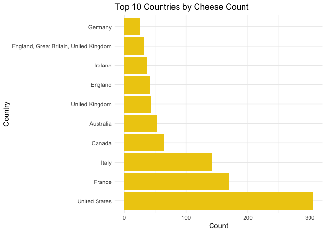
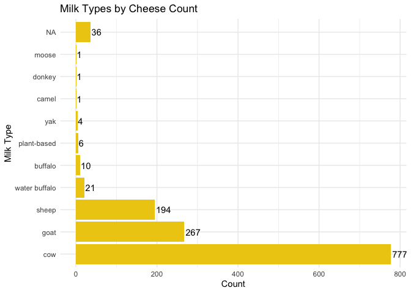

Cheese Data Analysis
================
Dakota Chang, Katherine Danielson
2025-04-17

- [Cheese Data Intro](#cheese-data-intro)
- [Importing Data and Libraries](#importing-data-and-libraries)
- [EDA](#eda)

## Cheese Data Intro

**Background Information**

(TODO: BACKGROUND STUFF)

Source:
<https://github.com/rfordatascience/tidytuesday/blob/main/data/2024/2024-06-04/readme.md>

## Importing Data and Libraries

``` r
library(tidyverse)
```

    ## ── Attaching core tidyverse packages ──────────────────────── tidyverse 2.0.0 ──
    ## ✔ dplyr     1.1.4     ✔ readr     2.1.5
    ## ✔ forcats   1.0.0     ✔ stringr   1.5.1
    ## ✔ ggplot2   3.5.1     ✔ tibble    3.2.1
    ## ✔ lubridate 1.9.3     ✔ tidyr     1.3.1
    ## ✔ purrr     1.0.2     
    ## ── Conflicts ────────────────────────────────────────── tidyverse_conflicts() ──
    ## ✖ dplyr::filter() masks stats::filter()
    ## ✖ dplyr::lag()    masks stats::lag()
    ## ℹ Use the conflicted package (<http://conflicted.r-lib.org/>) to force all conflicts to become errors

``` r
library(ggplot2)
library(dplyr)
library(tidyr)
```

``` r
cheeses <- readr::read_csv('https://raw.githubusercontent.com/rfordatascience/tidytuesday/main/data/2024/2024-06-04/cheeses.csv')
```

    ## Rows: 1187 Columns: 19
    ## ── Column specification ────────────────────────────────────────────────────────
    ## Delimiter: ","
    ## chr (17): cheese, url, milk, country, region, family, type, fat_content, cal...
    ## lgl  (2): vegetarian, vegan
    ## 
    ## ℹ Use `spec()` to retrieve the full column specification for this data.
    ## ℹ Specify the column types or set `show_col_types = FALSE` to quiet this message.

``` r
cheeses
```

    ## # A tibble: 1,187 × 19
    ##    cheese    url   milk  country region family type  fat_content calcium_content
    ##    <chr>     <chr> <chr> <chr>   <chr>  <chr>  <chr> <chr>       <chr>          
    ##  1 Aarewass… http… cow   Switze… <NA>   <NA>   semi… <NA>        <NA>           
    ##  2 Abbaye d… http… sheep France  Pays … <NA>   semi… <NA>        <NA>           
    ##  3 Abbaye d… http… cow   France  <NA>   <NA>   semi… 40-46%      <NA>           
    ##  4 Abbaye d… http… cow   France  Burgu… <NA>   semi… <NA>        <NA>           
    ##  5 Abbaye d… http… cow   France  Savoie <NA>   soft… <NA>        <NA>           
    ##  6 Abbaye d… http… cow   France  provi… <NA>   semi… <NA>        <NA>           
    ##  7 Abbaye d… http… cow   France  Nord-… <NA>   semi… 50%         <NA>           
    ##  8 Abbot’s … http… cow   Englan… North… Chedd… semi… <NA>        <NA>           
    ##  9 Abertam   http… sheep Czech … Karlo… <NA>   hard… 45%         <NA>           
    ## 10 Abondance http… cow   France  <NA>   <NA>   semi… <NA>        <NA>           
    ## # ℹ 1,177 more rows
    ## # ℹ 10 more variables: texture <chr>, rind <chr>, color <chr>, flavor <chr>,
    ## #   aroma <chr>, vegetarian <lgl>, vegan <lgl>, synonyms <chr>,
    ## #   alt_spellings <chr>, producers <chr>

## EDA

``` r
cheeses %>%
  group_by(country) %>%
  summarise(count = n()) %>%
  arrange(desc(count)) %>%
  head(10) %>%
  ggplot(aes(x = reorder(country, -count), y = count)) +
  geom_bar(stat = "identity") +
  coord_flip() +
  labs(title = "Top 10 Countries by Cheese Count", x = "Country", y = "Count")
```

<!-- -->

``` r
cheeses %>%
  group_by(milk) %>%
  summarise(count = n()) %>%
  arrange(desc(count)) %>%
  ggplot(aes(x = reorder(milk, -count), y = count)) +
  geom_bar(stat = "identity") +
  coord_flip() +
  labs(title = "Top Milk Types by Cheese Count", x = "Milk Type", y = "Count")
```

<!-- -->

``` r
cheeses %>%
  mutate(milk = str_split(milk, ", ")) %>%
  unnest(milk) %>%
  group_by(milk) %>%
  summarise(count = n()) %>%
  arrange(desc(count)) %>%
  ggplot(aes(x = reorder(milk, -count), y = count)) +
  geom_bar(stat = "identity", fill = '#eecc11') +
  coord_flip() +
  labs(title = "Milk Types by Cheese Count", x = "Milk Type", y = "Count") +
  geom_text(aes(x = milk, y = count,label=count),hjust=-0.1) +
  theme_minimal()
```

<!-- -->

``` r
cheeses %>%
  group_by(type) %>%
  summarise(count = n()) %>%
  arrange(desc(count)) %>%
  head(10) %>%
  ggplot(aes(x = reorder(type, -count), y = count)) +
  geom_bar(stat = "identity") +
  coord_flip() +
  labs(title = "Top 10 Types by Cheese Count", x = "Cheese Type", y = "Count")
```

<!-- -->

``` r
cheeses %>%
  mutate(type = str_split(type, ", ")) %>%
  unnest(type) %>%
  group_by(type) %>%
  summarise(count = n()) %>%
  arrange(desc(count)) %>%
  ggplot(aes(x = reorder(type, -count), y = count)) +
  geom_bar(stat = "identity", fill = '#eecc11') +
  coord_flip() +
  labs(title = "Types by Cheese Count", x = "Country", y = "Count") +
  geom_text(aes(x = type, y = count,label=count),hjust=-0.1) +
  theme_minimal()
```

<!-- -->
