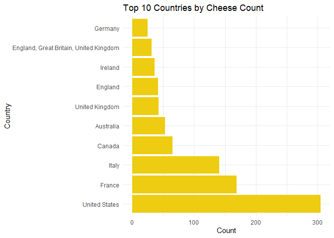
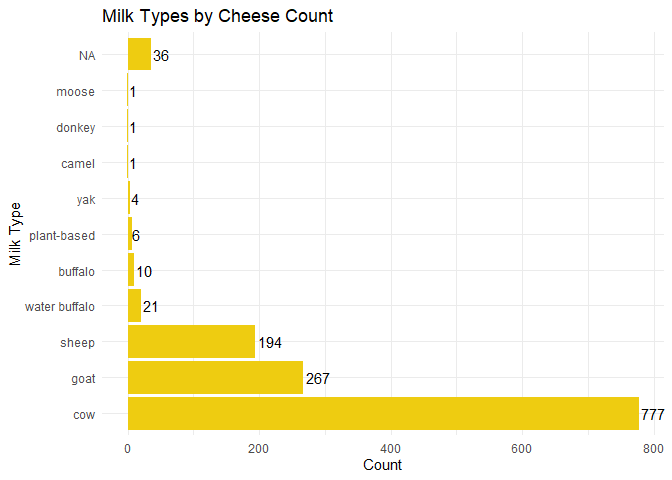
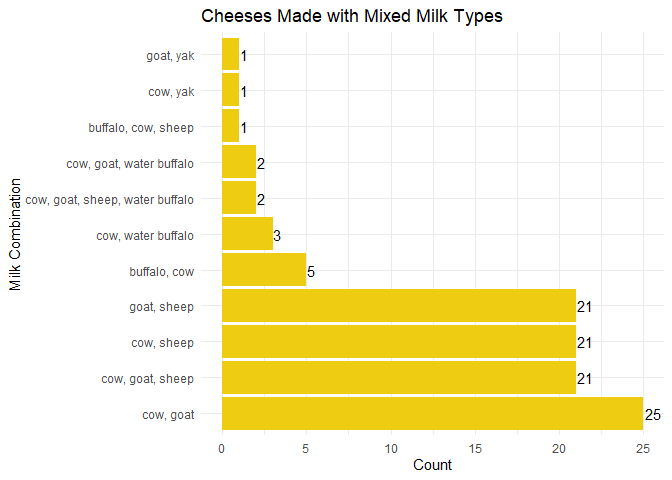
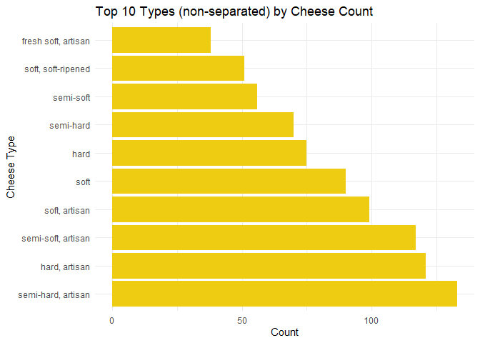
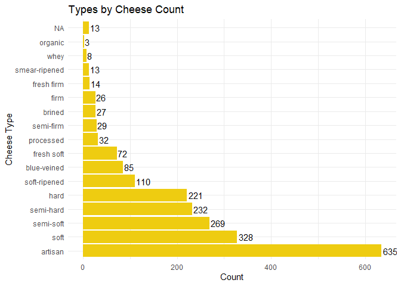
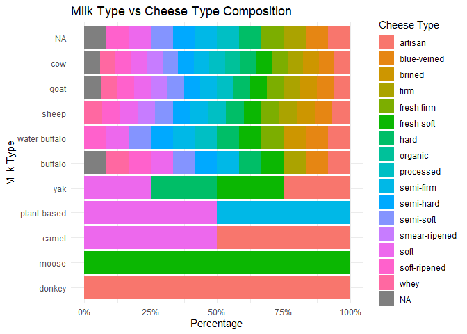
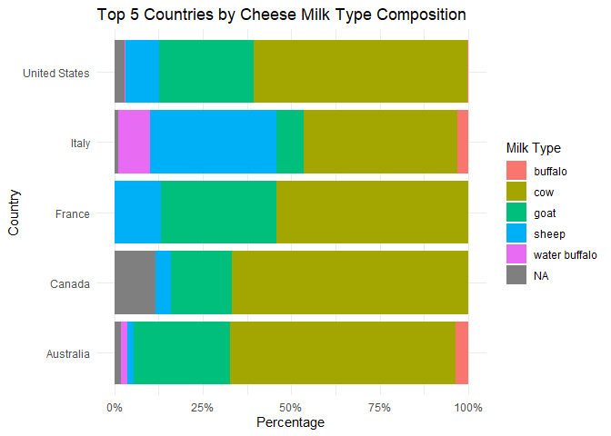
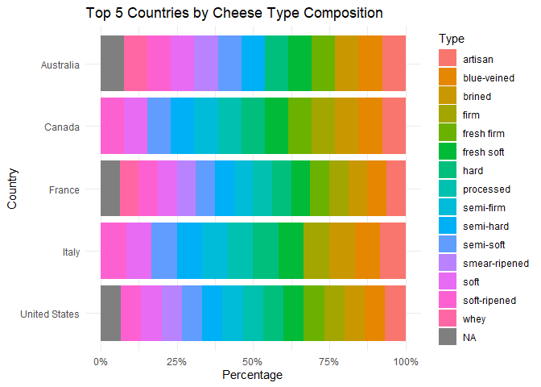
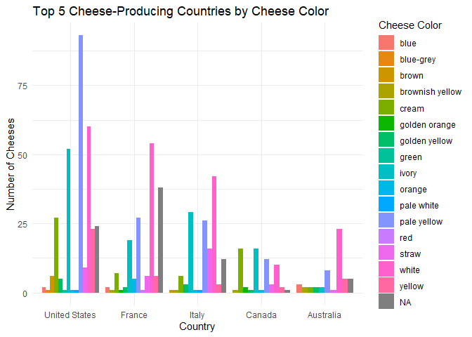

Cheese Data Analysis
================
Dakota Chang, Katherine Danielson
2025-04-25

- [Cheese Data Intro](#cheese-data-intro)
- [Importing Data and Libraries](#importing-data-and-libraries)
- [EDA and Basic Checks](#eda-and-basic-checks)
  - [Exploration of Country](#exploration-of-country)
  - [Exploration of Milk Types](#exploration-of-milk-types)
  - [Exploration of Cheese Types](#exploration-of-cheese-types)
- [Analysis](#analysis)
- [Conclusion and Remaining
  Questions](#conclusion-and-remaining-questions)

## Cheese Data Intro

#### **Background Information**

Source:
<https://github.com/rfordatascience/tidytuesday/blob/main/data/2024/2024-06-04/readme.md>

*Sourcing and Credibility*

This project uses the dataset from the [TidyTuesday: Cheese Week (June
4,
2024)](https://github.com/rfordatascience/tidytuesday/blob/main/data/2024/2024-06-04/readme.md)
initiative. The data is from Cheese.com, a long-standing online
encyclopedia for cheeses, and was scraped by data scientist Thomas Mock
and Jon Harmon for the purposes of public exploration and education.

This is a popular reference sites and is one of the largest cheese
databases in the world, hosting extensive listings and descriptions of
cheese worldwide. However, while it hosts a large amount of data, it is
not academic nor industry-certified; thus, it introduces uncertainty
about standardization and objectivity surrounding entries.
Unfortunately, the original site’s data-entry methodology is not
transparent.

*Potential Errors, Uncertainties and Ambiguities*

This source introduces a multitude of areas for potential error and
uncertainties.

Firstly, as this data was scraped from cheese.com in 2024, there are
discontinuities between the cheeses then and now. There is a possibility
this led to errors like 5 yak-milk cheeses being present in currently,
but only 4 in the 2024 scraping. While this could be due to timing
differences, with a lack of tracking on data entry times, this could
additionally be due to errors in scraping the web. Consequently, this
leads to questions on the legitimacy of the dataset.

Most importantly, there is a lack of transparency surrounding data entry
and collection which introduces potential errors in data classification.
If the website was created through other available data sources or
different customer entries, there could be potential errors in
classification (e.g., inconsistent naming of regions, vague flavor
descriptors) and missing values due to non-uniform entries across
cheeses. Additionally, it appears as though some cheeses are classified
as different cheeses when they are only aged differently, while some
cheeses are classified the same for different levels of aging.
Additionally, with a lack of transparency, there could be a bias in
certain aspects of data entry. For example, it appears in this dataset
that the United States of America produces the most kinds of cheese,
with France and Italy at different points behind. However, France and
Italy are renowned for being some of the top producers of cheeses
worldwide with the United States always behind them. As this is a
website that sells cheeses and/or offers locations to sell cheeses as
well as boasts its unique cheese collection, collection bias is
introduced. It is likely that cheeses that are overly common are highly
present as a site of cheeses would be “incomplete” without them.
Further, as they boast their unique and broad collection, they also
likely highlight very artisan and varied cheeses.

This dataset is a non-random sample, containing ~1,200 cheeses
documented on Cheese.com as of 2024. This does not represent the full
global population of cheeses but is instead a convenience sample—limited
to what has been posted/entered online. Therefore, selection bias is
present. Well-known cheeses or those with wider international
distribution are likely overrepresented. Regional or artisanal cheeses
with less online presence may be underrepresented. Additionally, due to
the fact that this sampling is not random, it would be unhelpful to
perform confidence and prediction intervals as data would be skewed.
Instead, source criticism (as seen above) is better to clarify the
uncertainty seen in this dataset.

#### **Population**

- We will be looking at the non-random sample (1187 cheese) from the
  cheese.com TidyTuesday dataset.

#### **Quantity of interest**

- Our main quantity of interest is the country. This recognizes where a
  cheese is being produced.

#### **Question / Hypothesis**

- How are the top five cheese-producing countries and cheese qualities,
  namely milk type, color and cheese type, related?

  - Null hypothesis: There is no statistical difference between the top
    five cheese-producing countries based on certain cheese qualities.

    - There is no statistical difference between the top five
      cheese-producing countries based on type of cheese.

    - There is no statistical difference between the top five
      cheese-producing countries based on the milk used in cheese.

    - There is no statistical difference between the top five
      cheese-producing countries based on the color of cheese.

## Importing Data and Libraries

``` r
library(tidyverse)
```

    ## ── Attaching core tidyverse packages ──────────────────────── tidyverse 2.0.0 ──
    ## ✔ dplyr     1.1.4     ✔ readr     2.1.5
    ## ✔ forcats   1.0.0     ✔ stringr   1.5.1
    ## ✔ ggplot2   3.5.1     ✔ tibble    3.2.1
    ## ✔ lubridate 1.9.4     ✔ tidyr     1.3.1
    ## ✔ purrr     1.0.2     
    ## ── Conflicts ────────────────────────────────────────── tidyverse_conflicts() ──
    ## ✖ dplyr::filter() masks stats::filter()
    ## ✖ dplyr::lag()    masks stats::lag()
    ## ℹ Use the conflicted package (<http://conflicted.r-lib.org/>) to force all conflicts to become errors

``` r
library(ggplot2)
library(dplyr)
library(tidyr)
library(purrr)
library(broom)
```

``` r
df_cheeses <- readr::read_csv('https://raw.githubusercontent.com/rfordatascience/tidytuesday/main/data/2024/2024-06-04/cheeses.csv')
```

    ## Rows: 1187 Columns: 19
    ## ── Column specification ────────────────────────────────────────────────────────
    ## Delimiter: ","
    ## chr (17): cheese, url, milk, country, region, family, type, fat_content, cal...
    ## lgl  (2): vegetarian, vegan
    ## 
    ## ℹ Use `spec()` to retrieve the full column specification for this data.
    ## ℹ Specify the column types or set `show_col_types = FALSE` to quiet this message.

``` r
df_cheeses
```

    ## # A tibble: 1,187 × 19
    ##    cheese    url   milk  country region family type  fat_content calcium_content
    ##    <chr>     <chr> <chr> <chr>   <chr>  <chr>  <chr> <chr>       <chr>          
    ##  1 Aarewass… http… cow   Switze… <NA>   <NA>   semi… <NA>        <NA>           
    ##  2 Abbaye d… http… sheep France  Pays … <NA>   semi… <NA>        <NA>           
    ##  3 Abbaye d… http… cow   France  <NA>   <NA>   semi… 40-46%      <NA>           
    ##  4 Abbaye d… http… cow   France  Burgu… <NA>   semi… <NA>        <NA>           
    ##  5 Abbaye d… http… cow   France  Savoie <NA>   soft… <NA>        <NA>           
    ##  6 Abbaye d… http… cow   France  provi… <NA>   semi… <NA>        <NA>           
    ##  7 Abbaye d… http… cow   France  Nord-… <NA>   semi… 50%         <NA>           
    ##  8 Abbot’s … http… cow   Englan… North… Chedd… semi… <NA>        <NA>           
    ##  9 Abertam   http… sheep Czech … Karlo… <NA>   hard… 45%         <NA>           
    ## 10 Abondance http… cow   France  <NA>   <NA>   semi… <NA>        <NA>           
    ## # ℹ 1,177 more rows
    ## # ℹ 10 more variables: texture <chr>, rind <chr>, color <chr>, flavor <chr>,
    ## #   aroma <chr>, vegetarian <lgl>, vegan <lgl>, synonyms <chr>,
    ## #   alt_spellings <chr>, producers <chr>

## EDA and Basic Checks

``` r
ncol(df_cheeses)
```

    ## [1] 19

``` r
nrow(df_cheeses)
```

    ## [1] 1187

``` r
summary(df_cheeses)
```

    ##     cheese              url                milk             country         
    ##  Length:1187        Length:1187        Length:1187        Length:1187       
    ##  Class :character   Class :character   Class :character   Class :character  
    ##  Mode  :character   Mode  :character   Mode  :character   Mode  :character  
    ##                                                                             
    ##     region             family              type           fat_content       
    ##  Length:1187        Length:1187        Length:1187        Length:1187       
    ##  Class :character   Class :character   Class :character   Class :character  
    ##  Mode  :character   Mode  :character   Mode  :character   Mode  :character  
    ##                                                                             
    ##  calcium_content      texture              rind              color          
    ##  Length:1187        Length:1187        Length:1187        Length:1187       
    ##  Class :character   Class :character   Class :character   Class :character  
    ##  Mode  :character   Mode  :character   Mode  :character   Mode  :character  
    ##                                                                             
    ##     flavor             aroma           vegetarian        vegan        
    ##  Length:1187        Length:1187        Mode :logical   Mode :logical  
    ##  Class :character   Class :character   FALSE:386       FALSE:742      
    ##  Mode  :character   Mode  :character   TRUE :362       TRUE :6        
    ##                                        NA's :439       NA's :439      
    ##    synonyms         alt_spellings       producers        
    ##  Length:1187        Length:1187        Length:1187       
    ##  Class :character   Class :character   Class :character  
    ##  Mode  :character   Mode  :character   Mode  :character  
    ## 

``` r
df_cheeses %>% 
  distinct(cheese)
```

    ## # A tibble: 1,187 × 1
    ##    cheese                 
    ##    <chr>                  
    ##  1 Aarewasser             
    ##  2 Abbaye de Belloc       
    ##  3 Abbaye de Belval       
    ##  4 Abbaye de Citeaux      
    ##  5 Abbaye de Tamié        
    ##  6 Abbaye de Timadeuc     
    ##  7 Abbaye du Mont des Cats
    ##  8 Abbot’s Gold           
    ##  9 Abertam                
    ## 10 Abondance              
    ## # ℹ 1,177 more rows

``` r
sapply(df_cheeses, function(x) sum(is.na(x)))  # Count missing values per column
```

    ##          cheese             url            milk         country          region 
    ##               0               0              36              11             332 
    ##          family            type     fat_content calcium_content         texture 
    ##             698              13             939            1162              58 
    ##            rind           color          flavor           aroma      vegetarian 
    ##             242             142              98             258             439 
    ##           vegan        synonyms   alt_spellings       producers 
    ##             439             893            1078             400

**Observations:**

- This dataset has 19 columns and 1187 rows.

  - As each cheese only has one set of information associated with it,
    that means there are 1187 distinct cheeses in the dataset. Thus,
    each cheese is only found in one county/region.

- The majority of data in the dataset is in character form.

  - Things like `type`, `texture` and `flavor` are all characters
    separated by commas. Thus, data analysis can both be performed with
    the data as it is and data where the lists are wrangled apart.

- There are a lot of missing datapoints in a variety of columns.

  - The only two columns that have no missing information are `cheese`
    and its associated `url`.

  - Comparatively, `alt_spellings` has the highest number at 1078. This
    indicates that 1078 of the cheeses do no have any other spellings,
    which should not impact data analysis.

  - However, there are some more valuable variables that are missing a
    high quantity of their data such as `fat_content` and `region` and
    if a cheese is `vegetarian`.

- The majority of cheese recorded are not `vegan` while roughly 50% of
  the cheeses that report if they are `vegetarian` show that they are.

The important variables in this dataset are:

| Variable | Class | Description |
|----|----|----|
| cheese | character | Name of the cheese. |
| url | character | Location of the cheese’s description at cheese.com |
| milk | character | The type of milk used for the cheese, when known. |
| country | character | The country or countries of origin of the cheese. |
| region | character | The region in which the cheese is produced, either within the country of origin, or as a wider description of multiple countries. |
| family | character | The family to which the cheese belongs, if any. |
| type | character | The broad type or types to describe the cheese. |
| fat_content | character | The fat content of the cheese, as a percent or range of percents. |
| calcium_content | character | The calcium content of the cheese, when known. Values include units. |
| texture | character | The texture of the cheese. |
| rind | character | The type of rind used in producing the cheese. |
| color | character | The color of the cheese. |
| flavor | character | Characteristic(s) of the taste of the cheese. |
| aroma | character | Characteristic(s) of the smell of the cheese. |
| vegetarian | logical | Whether cheese.com considers the cheese to be vegetarian. |
| vegan | logical | Whether cheese.com considers the cheese to be vegan. |
| synonyms | character | Alternative names of the cheese. |
| alt_spellings | character | Alternative spellings of the name of the cheese (likely overlaps with synonyms). |
| producers | character | Known producers of the cheese. |

### Exploration of Country

``` r
df_cheeses %>%
  group_by(country) %>%
  summarise(count = n()) %>%
  arrange(desc(count)) %>%
  head(10) %>%
  ggplot(aes(x = reorder(country, -count), y = count)) +
  geom_bar(stat = "identity", fill = '#eecc11') +
  coord_flip() +
  labs(title = "Top 10 Countries by Cheese Count", x = "Country", y = "Count")+
  theme_minimal()
```

<!-- -->

**Observations:**

- In this database, the United States has a significantly higher number
  of cheese types represented compared to other countries. The U.S.
  lists over 300 types, while the second-highest, France, has just over
  150—meaning the U.S. has nearly twice as many. This discrepancy could
  be due to a few factors. The most likely explanations are: (1) the
  U.S. genuinely produces a wider variety of cheeses, or (2) the source
  of the data—a cheese e-commerce platform—may be based in the U.S. or
  have more partnerships with U.S.-based producers.

### Exploration of Milk Types

``` r
df_cheeses %>%
  mutate(milk = str_split(milk, ", ")) %>%
  unnest(milk) %>%
  group_by(milk) %>%
  summarise(count = n()) %>%
  arrange(desc(count)) %>%
  ggplot(aes(x = reorder(milk, -count), y = count)) +
  geom_bar(stat = "identity", fill = '#eecc11') +
  coord_flip() +
  labs(title = "Milk Types by Cheese Count", x = "Milk Type", y = "Count") +
  geom_text(aes(x = milk, y = count,label=count),hjust=-0.1) +
  theme_minimal()
```

<!-- -->

**Observations:**

- It seems that the overwhelming majority of cheese is made from cow’s
  milk, with goat’s milk being the second most common. This is not
  surprising, as cow’s milk is the most widely produced milk in the
  world. Sheep’s milk is the third most common, but it is still
  significantly less common than cow’s and goat’s milk. This is likely
  due to the fact that sheep’s milk is less widely available and more
  expensive than cow’s and goat’s milk. We also see a few interesting
  milks, for example, there is one cheese made of moose milk, one of
  donkey milk, one of camel milk, and four of yak milks. We also see
  that plant-based milks are listed, but not with any specifications of
  which kind. It is important to note that this graph removes the detail
  of cheese made with a few different milks.

``` r
df_cheeses %>%
  filter(str_detect(milk, ", ")) %>%  # Only rows with multiple milk types
  group_by(milk) %>%
  summarise(count = n()) %>%
  arrange(desc(count)) %>%
  ggplot(aes(x = reorder(milk, -count), y = count)) +
  geom_bar(stat = "identity", fill = '#eecc11') +
  coord_flip() +
  labs(title = "Cheeses Made with Mixed Milk Types", x = "Milk Combination", y = "Count") +
  geom_text(aes(label = count), hjust = -0.1) +
  theme_minimal()
```

<!-- -->

**Observations:**

- The most common combination of milk types is cow and goat, which is
  not surprising given that these are the two most common types of milk
  used in cheese production. We also see that there are two cheeses that
  are made from four types of milk (cow, goat, sheep, water buffalo).

### Exploration of Cheese Types

``` r
df_cheeses %>%
  group_by(type) %>%
  summarise(count = n()) %>%
  arrange(desc(count)) %>%
  head(10) %>%
  ggplot(aes(x = reorder(type, -count), y = count)) +
  geom_bar(stat = "identity", fill = '#eecc11') +
  coord_flip() +
  labs(title = "Top 10 Types (non-separated) by Cheese Count", x = "Cheese Type", y = "Count")+
  theme_minimal()
```

<!-- -->

**Observations:**

- The most common cheese type is semi-hard and artisan. The top four all
  include artisan as a quality, which is not a regulated term, and might
  be used as a marketing tactic when it comes to types.

``` r
df_cheeses %>%
  mutate(type = str_split(type, ", ")) %>%
  unnest(type) %>%
  group_by(type) %>%
  summarise(count = n()) %>%
  arrange(desc(count)) %>%
  ggplot(aes(x = reorder(type, -count), y = count)) +
  geom_bar(stat = "identity", fill = '#eecc11') +
  coord_flip() +
  labs(title = "Types by Cheese Count", x = "Cheese Type", y = "Count") +
  geom_text(aes(x = type, y = count,label=count),hjust=-0.1) +
  theme_minimal()
```

<!-- -->

**Observations:**

- We see that artisan is the most popular `type` of cheese. This is then
  followed by soft and semi-soft, suggesting that they are additionally
  popular kinds of cheese on cheese.com. When looking at the graph “Top
  10 Types (non-separated) by Cheese Count” we can see that the top four
  cheese `types` all include some form of artisan cheese type; thus,
  making the 635 counts of artisan cheese highly reasonable.
  Additionally, that graph shows a wide combination of different types
  of soft and semi-soft cheeses, indicating it is a popular blended type
  or characterization of cheese.

``` r
# stacked bar chart cheese vs milk types ordered by number of cheese types
df_cheeses %>%
  mutate(
    milk_list = str_split(milk, ", ")
  ) %>%
  unnest(milk_list) %>%
  mutate(
    type_list = str_split(type, ", ")
  ) %>%
  unnest(type_list) %>%
  group_by(milk_list, type_list) %>%
  summarise(count = n()) %>%
  arrange(desc(count)) %>% 
  group_by(milk_list) %>% 
  mutate(
    n_total = sum(count),
    frac = count / n_total,
    n_categories = n()
  ) %>% 
  ggplot(aes(x = reorder(milk_list, n_categories), fill = type_list)) +
  geom_bar(position = "fill") +
  scale_y_continuous(labels = scales::percent_format()) +
  coord_flip() +
  labs(
    title = "Milk Type vs Cheese Type Composition",
    x = "Milk Type", y = "Percentage", fill = "Cheese Type"
  ) +
  theme_minimal()
```

    ## `summarise()` has grouped output by 'milk_list'. You can override using the
    ## `.groups` argument.

<!-- -->

**Observations:**

- Less popular/common milk types, such as donkey, moose, camel, and
  plant-based, have many fewer types of cheeses that they are made into.
  It is possible that certain types of milk only have properties
  conducive to certain types of cheese. Comparatively, milks that are
  more common, like cow, goat and sheep milk are able to be used in a
  lot more types of cheese.

## Analysis

This section includes analysis for the null hypothesis and its three
sub-hypotheses.

``` r
# stacked bar chart of milk type in top 5 country

df_cheeses %>%
  mutate(
    milk_list = str_split(milk, ", ")
  ) %>%
  unnest(milk_list) %>%
  filter(country %in% c("United States", "France", "Italy", "Canada", "Australia")) %>%
  ggplot(aes(x = country, fill = milk_list)) +
  geom_bar(position = "fill") +
  scale_y_continuous(labels = scales::percent_format()) +
  coord_flip() +
  labs(
    title = "Top 5 Countries by Cheese Milk Type Composition",
    x = "Country", y = "Percentage", fill = "Milk Type"
  ) +
  theme_minimal()
```

<!-- -->

``` r
#Chi-Squared test overall
# Build contingency table from raw counts
milk_country_table <- df_cheeses %>%
  mutate(milk_list = str_split(milk, ", ")) %>%
  unnest(milk_list) %>%
  filter(country %in% c("United States", "France", "Italy", "Canada", "Australia")) %>%
  count(country, milk_list) %>%
  pivot_wider(names_from = milk_list, values_from = n, values_fill = 0) %>%
  column_to_rownames("country") %>%
  as.matrix()

# Perform Chi-squared test
milk_chisq_result <- chisq.test(milk_country_table)
```

    ## Warning in chisq.test(milk_country_table): Chi-squared approximation may be
    ## incorrect

``` r
# Output result
milk_chisq_result
```

    ## 
    ##  Pearson's Chi-squared test
    ## 
    ## data:  milk_country_table
    ## X-squared = 193.21, df = 20, p-value < 2.2e-16

``` r
#Chi-Squared between each type of milke
top_countries <- df_cheeses %>%
  count(country, sort = TRUE) %>%
  slice_head(n = 5) %>%
  pull(country)

# Prepare the dataset with individual milk types
df_milk_split <- df_cheeses %>%
  filter(country %in% top_countries) %>%
  mutate(milk_list = str_split(milk, ", ")) %>%
  unnest(milk_list)

# Get unique milk types
milk_types <- df_milk_split %>%
  distinct(milk_list) %>%
  pull()

# Perform a chi-squared test for each milk type across countries
milk_chi_tests <- map_df(milk_types, function(milk_type) {
  df_test <- df_milk_split %>%
    mutate(has_milk = milk_list == milk_type) %>%
    count(country, has_milk) %>%
    pivot_wider(names_from = has_milk, values_from = n, values_fill = 0)

  # Skip if not enough variation
  if (ncol(df_test) < 3 || sum(df_test[[2]]) == 0 || sum(df_test[[3]]) == 0) {
    return(NULL)
  }

  tbl <- as.matrix(df_test[,-1])
  rownames(tbl) <- df_test$country

  chisq_result <- chisq.test(tbl)
  tidy(chisq_result) %>%
    mutate(milk_type = milk_type)
})
```

    ## Warning in chisq.test(tbl): Chi-squared approximation may be incorrect

    ## Warning in chisq.test(tbl): Chi-squared approximation may be incorrect
    ## Warning in chisq.test(tbl): Chi-squared approximation may be incorrect
    ## Warning in chisq.test(tbl): Chi-squared approximation may be incorrect
    ## Warning in chisq.test(tbl): Chi-squared approximation may be incorrect

``` r
# View results
milk_chi_tests %>%
  select(milk_type, statistic, p.value) %>%
  arrange(p.value)
```

    ## # A tibble: 5 × 3
    ##   milk_type     statistic  p.value
    ##   <chr>             <dbl>    <dbl>
    ## 1 sheep             105.  3.29e-19
    ## 2 water buffalo      77.4 1.63e-13
    ## 3 goat               63.1 1.12e-10
    ## 4 cow                53.4 8.96e- 9
    ## 5 buffalo            43.3 7.77e- 7

**Observations:**

*“Top 5 Countries by Cheese Milk Type Composition”*

- This stacked bar chart shows that certain countries bias developing
  cheeses with certain types of milk. For example, Italy has a lot more
  cheeses made with sheep milk compared to all other countries. However,
  there can be trends seen for the most common kinds of milk across all
  countries. That is, in all top five countries, cow milk is the most
  common type of milk to use in cheeses. With the exception of Italy
  (which uses a lot more sheep and water buffalo milk than any other
  country), goat milk and then sheep milk are the next two most popular
  kinds of milk in cheeses. It is important to note that the actual
  percentage allocations between all the countries shift quiet variably.

- The United States, Italy, Canada and Australia all appear to use at
  least some percent of buffalo, cow, goat, sheep and water buffalo milk
  and have at least some milks where the cheese was not reported (NA).
  Comparatively, cheeses from France appear to have all milk documented
  for all of their cheeses (no NA values) and only use three milks: goat
  sheep and cow.

*Chi-Squared Tests*

- When performing a single chi-squared test across countries with their
  milk counts, the chi-squared across all cheeses and the top five
  countries shows a very low p value and a very high X-squared value,
  indicating significant difference.

- The second chi-squared test looks at each individual cheese’s
  variation. All of them still have a p-value beneath 0.01 and have a
  very high X-squared value. The most prominent statistical difference
  is seen through the proportionate use of sheep milk. When referencing
  the *Top 5 Countries by Cheese Milk Type Composition* we see that this
  is echoed with the high level of variation seen between the size of
  blue bars across countries. Overarchingly, it is reasonable to say
  there is a statistical difference between the top five countries
  producing cheese and their milk proportion use.

``` r
# stacked bar chart of cheese type in top 5 country
df_cheeses %>%
  mutate(
    type_list = str_split(type, ", ")
  ) %>%
  unnest(type_list) %>%
  filter(country %in% c(
    "United States",
    "France",
    "Italy",
    "Canada",
    "Australia"
  )) %>%
  group_by(country, type_list) %>%
  summarise(count = n()) %>%
  arrange(desc(count)) %>%
  ggplot(aes(x = reorder(country, -count), fill = type_list)) +
  geom_bar(position = "fill") +
  scale_y_continuous(labels = scales::percent_format()) +
  coord_flip() +
  labs(
    title = "Top 5 Countries by Cheese Type Composition",
    x = "Country", y = "Percentage", fill = "Type"
  ) +
  theme_minimal()
```

    ## `summarise()` has grouped output by 'country'. You can override using the
    ## `.groups` argument.

<!-- -->

``` r
#Chi-Squared test overall
# Build contingency table from raw counts
type_country_table <- df_cheeses %>%
  mutate(type_list = str_split(type, ", ")) %>%
  unnest(type_list) %>%
  filter(country %in% c("United States", "France", "Italy", "Canada", "Australia")) %>%
  count(country, type_list) %>%
  pivot_wider(names_from = type_list, values_from = n, values_fill = 0) %>%
  column_to_rownames("country") %>%
  as.matrix()

# Perform Chi-squared test
type_chisq_result <- chisq.test(type_country_table)
```

    ## Warning in chisq.test(type_country_table): Chi-squared approximation may be
    ## incorrect

``` r
# Output result
type_chisq_result
```

    ## 
    ##  Pearson's Chi-squared test
    ## 
    ## data:  type_country_table
    ## X-squared = 313.94, df = 60, p-value < 2.2e-16

``` r
#Chi-Squared between each chees type across countries
# Prepare the dataset with individual milk types
df_type_split <- df_cheeses %>%
  filter(country %in% top_countries) %>%
  mutate(type_list = str_split(type, ", ")) %>%
  unnest(type_list)

# Get unique milk types
type_types <- df_type_split %>%
  distinct(type_list) %>%
  pull()

# Perform a chi-squared test for each milk type across countries
type_chi_tests <- map_df(type_types, function(type_type) {
  df_type_test <- df_type_split %>%
    mutate(has_type = type_list == type_type) %>%
    count(country, has_type) %>%
    pivot_wider(names_from = has_type, values_from = n, values_fill = 0)

  # Skip if not enough variation
  if (ncol(df_type_test) < 3 || sum(df_type_test[[2]]) == 0 || sum(df_type_test[[3]]) == 0) {
    return(NULL)
  }

  tbl <- as.matrix(df_type_test[,-1])
  rownames(tbl) <- df_type_test$country

  chisq_result <- chisq.test(tbl)
  tidy(chisq_result) %>%
    mutate(type_type = type_type)
})
```

    ## Warning in chisq.test(tbl): Chi-squared approximation may be incorrect

    ## Warning in chisq.test(tbl): Chi-squared approximation may be incorrect
    ## Warning in chisq.test(tbl): Chi-squared approximation may be incorrect
    ## Warning in chisq.test(tbl): Chi-squared approximation may be incorrect
    ## Warning in chisq.test(tbl): Chi-squared approximation may be incorrect
    ## Warning in chisq.test(tbl): Chi-squared approximation may be incorrect
    ## Warning in chisq.test(tbl): Chi-squared approximation may be incorrect
    ## Warning in chisq.test(tbl): Chi-squared approximation may be incorrect
    ## Warning in chisq.test(tbl): Chi-squared approximation may be incorrect
    ## Warning in chisq.test(tbl): Chi-squared approximation may be incorrect
    ## Warning in chisq.test(tbl): Chi-squared approximation may be incorrect
    ## Warning in chisq.test(tbl): Chi-squared approximation may be incorrect
    ## Warning in chisq.test(tbl): Chi-squared approximation may be incorrect
    ## Warning in chisq.test(tbl): Chi-squared approximation may be incorrect
    ## Warning in chisq.test(tbl): Chi-squared approximation may be incorrect

``` r
# View results
type_chi_tests %>%
  select(type_type, statistic, p.value) %>%
  arrange(p.value)
```

    ## # A tibble: 15 × 3
    ##    type_type     statistic  p.value
    ##    <chr>             <dbl>    <dbl>
    ##  1 soft             118.   7.60e-22
    ##  2 soft-ripened      53.0  1.08e- 8
    ##  3 fresh soft        32.6  7.25e- 5
    ##  4 hard              28.4  4.06e- 4
    ##  5 artisan           24.9  1.60e- 3
    ##  6 fresh firm        20.7  8.03e- 3
    ##  7 whey              20.3  9.14e- 3
    ##  8 smear-ripened     17.7  2.33e- 2
    ##  9 semi-hard         17.6  2.46e- 2
    ## 10 blue-veined       17.3  2.69e- 2
    ## 11 semi-firm         13.0  1.11e- 1
    ## 12 firm               7.78 4.55e- 1
    ## 13 processed          7.61 4.72e- 1
    ## 14 semi-soft          7.03 5.34e- 1
    ## 15 brined             4.53 8.06e- 1

**Observations:**

*Top 5 Countries by Cheese Type Composition*

- When looking at the visualization “Top 5 Countries by Cheese Type
  Composition,” there is a very large span of cheese types and the
  presence of each of them.

- All countries have a wide distribution of cheese types, with very few
  cheese types not represented many times. One of the few cheeses that
  follow this exception is whey cheese which is only seen in France and
  Australia. Some countries have greater level of cheese type reportings
  than other countries. Australia, France and United States all have NA
  reportings that are roughly equal to one type of cheese. However,
  Italy and Canada both have little to no NA reportings. This lack of
  NAs allows there to be much greater quantities in different cheese
  types. For example, Italy has a much larger amount of soft-ripened
  cheese than other countries. However, as there are so many different
  cheese types and such a large quantity of cheeses reported in the
  dataset, this graph is very hard to determine. Thus, a chi-squared
  analysis was performed to try to better understand the variation
  between cheese types across the top five different countries.

*Chi-Squared Table*

- The chi-squared table shows that there is a statistical difference
  between different countries and certain cheese types. The overall
  chi-squared test shows a high value in the X-squared value and a very
  low p-value, indicating high statistical difference. To break this
  analysis down further, we performed a chi-squared for each individual
  cheese type across the different countries. With a 0.05 threshold,
  every single cheese still had a high X-squared value and low p-value
  and was able to remain statistically different. Out of all of the
  cheese types, soft is by far the most statistically different and
  soft-ripened and fresh soft come soon after. This indicates that there
  is large variance in the soft cheese category between countries which
  makes sense as it is one of the most popular/produces types of cheese.

``` r
top_countries <- df_cheeses %>%
  count(country, sort = TRUE) %>%
  slice_head(n = 5) %>%
  pull(country)

# Then, filter the data to only include those countries and group by cheese_color
df_cheeses %>%
  filter(country %in% top_countries) %>%
  group_by(country, color) %>%
  summarise(count = n(), .groups = "drop") %>%
  ggplot(aes(x = reorder(country, -count), y = count, fill = color)) +
  geom_bar(stat = "identity", position = "dodge") +
  labs(
    x = "Country",
    y = "Number of Cheeses",
    title = "Top 5 Cheese-Producing Countries by Cheese Color",
    fill = "Cheese Color"
  ) +
  theme_minimal()
```

<!-- -->

``` r
#Chi-Squared test overall
# Build contingency table from raw counts
color_country_table <- df_cheeses %>%
  mutate(color_list = str_split(color, ", ")) %>%
  unnest(color_list) %>%
  filter(country %in% c("United States", "France", "Italy", "Canada", "Australia")) %>%
  count(country, color_list) %>%
  pivot_wider(names_from = color_list, values_from = n, values_fill = 0) %>%
  column_to_rownames("country") %>%
  as.matrix()

# Perform Chi-squared test and output result
color_chisq_result <- chisq.test(color_country_table)
```

    ## Warning in chisq.test(color_country_table): Chi-squared approximation may be
    ## incorrect

``` r
color_chisq_result
```

    ## 
    ##  Pearson's Chi-squared test
    ## 
    ## data:  color_country_table
    ## X-squared = 190.15, df = 64, p-value = 1.918e-14

``` r
#Run a Chi Squared test for each color across the different top five countries
# Top 5 countries with most cheeses
top_countries <- df_cheeses %>%
  count(country, sort = TRUE) %>%
  slice_head(n = 5) %>%
  pull(country)

# Filter cheese data to top countries only
df_filtered <- df_cheeses %>%
  filter(country %in% top_countries)

# List of cheese colors
cheese_colors <- df_filtered %>%
  distinct(color) %>%
  pull()

# Run chi-squared test per color, safely
color_tests <- map_df(cheese_colors, function(clr) {
  df_color <- df_filtered %>%
  filter(color == clr)

  # Contingency table of country counts
  tbl <- table(df_color$country)

  # Skip if less than 2 non-zero entries
  if (sum(tbl > 0) < 2) return(NULL)

  # Run test and return tidy result
  chisq_result <- chisq.test(tbl)
  tidy(chisq_result) %>%
  mutate(color = clr)
})
```

    ## Warning in chisq.test(tbl): Chi-squared approximation may be incorrect

    ## Warning in chisq.test(tbl): Chi-squared approximation may be incorrect
    ## Warning in chisq.test(tbl): Chi-squared approximation may be incorrect
    ## Warning in chisq.test(tbl): Chi-squared approximation may be incorrect
    ## Warning in chisq.test(tbl): Chi-squared approximation may be incorrect
    ## Warning in chisq.test(tbl): Chi-squared approximation may be incorrect
    ## Warning in chisq.test(tbl): Chi-squared approximation may be incorrect

``` r
# View results
color_tests %>%
  select(color, statistic, p.value)
```

    ## # A tibble: 13 × 3
    ##    color           statistic  p.value
    ##    <chr>               <dbl>    <dbl>
    ##  1 yellow             38.3   9.68e- 8
    ##  2 ivory              58.5   5.92e-12
    ##  3 white              46.7   1.77e- 9
    ##  4 pale yellow       143.    6.13e-30
    ##  5 orange              6     1.12e- 1
    ##  6 blue                0.286 8.67e- 1
    ##  7 brown               3.57  5.88e- 2
    ##  8 golden yellow       3.54  4.72e- 1
    ##  9 cream              34.6   5.65e- 7
    ## 10 straw              19.7   5.69e- 4
    ## 11 brownish yellow     0.6   8.96e- 1
    ## 12 golden orange       0.333 5.64e- 1
    ## 13 pale white          0     1   e+ 0

**Observations:**

*“Top 5 Cheese-Producing Countries by Cheese Color”*

- When looking at the visualization “Top 5 Cheese-Producing Countries by
  Cheese Color” there is a very large span of cheese colors and the
  presence of each of them.

- Three colors as well as NAs appear to be prominent across all of the
  top five countries: pale yellow, white, and ivory. While these three
  cheese are all mostly prominent (but to a lesser extent in Australia),
  there is still a large variation between all of the countries. This
  could be for a variety of different reasons. This could be influenced
  by the milk and type palette of the cheese as well as the overall
  production value. The latter is largely true as we see generally an
  overarching decreasing trend as we go from the U.S. to France to Italy
  to Canada to Australia with the cheese colors. However, there are
  several exceptions. One of these exceptions is the minimal/diminished
  presence of white cheese in Canada, where the coloring is more
  distributed, while Australia has mainly white cheeses. Another
  exception is pale yellow cheese and to an extent ivory cheese. This
  cheese is seen in abundance in the United States, but much less so in
  other countries.

- It is important to note that NA reportings for cheese colors appear to
  be especially high in places like France. This could lead to a skewing
  of data and make it hard to interpret if the values are actually
  statistically different.

*Chi-Squared Table*

- The chi-squared table shows that there is a statistical difference
  between different countries and certain cheese colors. The three
  cheese colors exhibiting the highest difference are ivory, white and
  pale yellow (as seen in the prior observations). These cheese colors
  have both a very low p-value and a very high chi-squared statistic
  value, indicating a large difference between countries. When setting a
  0.05 significance value 6/13 cheeses fall above this list, indicating
  that due to their higher p-value and low statistic value, there is not
  a statistical difference between cheese color and country for them.
  This may be due to a smaller sample size/presence of these cheeses in
  general, however. Overall, it can be said that there is a statistical
  difference between certain cheese colors across the top five countries
  that produce cheese.

## Conclusion and Remaining Questions

***Conclusions***

Our guiding question for this analysis was: “How are the top five
cheese-producing countries and cheese qualities, namely milk type, color
and cheese type, related?” In turn, this led to the null hypotheses of:

- There is no statistical difference between the top five
  cheese-producing countries based on certain cheese qualities.
  - There is no statistical difference between the top five
    cheese-producing countries based on type of cheese.
  - There is no statistical difference between the top five
    cheese-producing countries based on the milk used in cheese.
  - There is no statistical difference between the top five
    cheese-producing countries based on the color of cheese.

From our key analyses about we reject the null hypothesis “There is no
statistical difference between the top five cheese-producing countries
based on certain cheese qualities.”

Instead, as proven through three different chi-squared analyses and data
visualization for each of our three more specific null hypotheses, there
is statistical difference between the top five cheese-producing
countries, the types of cheese they make, the color the cheeses and milk
used in them.

When looking at the graph *“Top 5 Countries by Cheese Milk Type
Composition,”* and its consequent chi-squared analysis, we reject the
null hypothesis “There is no statistical difference between the top five
cheese-producing countries based on the milk used in cheese.” The
overall chi-squared analysis shows an X-squared value of 193.21 and a
p-value of 2.2\*10^-6. These values indicate statistical difference.
While there are similar trends of what milk is deemed “most popular” or
“most used,” the actual proportion of its use between each country
varies widely. Further, After the top 1-2 milk types, the countries vary
widely on choice.

When looking at the graph “*Top 5 Countries by Cheese Type Composition”*
and its consequent chi-squared analysis, we reject the null
hypothesis”There is no statistical difference between the top five
cheese-producing countries based on type of cheese. Instead, its overall
chi-squared analysis indicates an X-squared value of 313.94 and a
p-value of 2.2\*10^-6, indicating statistical variance. When further
breaking the analysis down to look at each cheese type across each
country, all p-values remained below 0.05. Most countries have a very
wide variety of cheese types that they use. More importantly, the most
statistically significant groups tend to have a common genre of type.
That is, soft is by far the most statistically different and
soft-ripened and fresh soft come soon after. All three cheeses belong to
the “soft” grouping, and if these three were lumped together, or cheese
were grouped otherwise (ex. hard, firm, ripened, etc) there could be
differences in the results.

Lastly, when looking at the graph *“Top 5 Cheese-Producing Countries by
Cheese Color,”* and its consequent chi-squared analysis, we reject the
null hypothesis “There is no statistical difference between the top five
cheese-producing countries based on the color of cheese.” Instead, when
looking at its chi-squared analysis, we find that 7/13 cheese colors
have statistical difference across the countries, as they have p-values
below 0.05 and a high X-squared value. The overall chi-squared value has
a p-value of 1.918\*10^-14 and an X-squared value of 190.15. While color
is statistically different amongst countries, the chi-squared analysis
is likely highly influenced by the pale yellow, ivory, white and yellow
p-values. There is large variation between main colors, but it
diminishes as color popularity decreases.

However, despite rejecting all three null hypotheses, the results may
not be fully trusted. The source for which this data comes from calls
into several questions and possible sources of error that could
influence these findings. One such source of error/influence comes from
the selection of cheese data seen on the cheese.com website. As
cheese.com boasts a wide range of cheeses, it is plasusible that they
may pull a wide variety of cheeses. In doing so, they could curate a
cheese database with a wider variety of milk types, cheese types and
colors than typical. This in turn would make data seem a lot more
statistically different than it actually is. Additionally, as cheese.com
includes no indication of popularity of production and only shows that
it is produced in a certain country, this could influence the
statistical difference as well. For example, the number of types of
cheese with straw coloring is very low, but if it is a highly popular
cheese, it could be the most produced cheese color in a country. Due to
the lack of production quantification, there is no way to tell this.
Other areas of error include the fact that each cheese is produced in
only one country, leading to limitations in variance, as well as a lack
of reporting and NA values. Some times, the NA values account for the
same quantity as a factor in a variable does. If these NA values had
reportings, it is plausible that differences could shift. Due to these
reasons, while we still reject the null hypotheses, we recommend
proceeding with caution before designing models or making estimates
based on this non-random sample.

***Remaining Questions***

After performing this analysis, several questions still remain.

As this analysis only focused on the top five cheese-producing countries
to make the analysis comprehensible, it would be interesting to *analyze
other countries further*. This could lead to several questions:

- “Do these statistical differences continue when analyzing only smaller
  cheese-producing countries?”

- “How does variation in cheese type, milk and color change when
  countries produce less cheese?”

Other questions could look at *more aspects of cheese or different
regions*:

- “How are country and cheese qualities, namely milk type, flavor and
  cheese type, related?”

- “How are regions in a specific country and cheese qualities, namely
  milk type, flavor and cheese type, related?”

- “How are the country and cheese qualities, namely cheese flavor,
  family and texture, related?”

As the *method of data collection and categorization* is unclear it led
to several other questions:

- “How was the color and flavor of cheese determined? Is there a
  standardized way that these were categorized?”

- “Why can a cheese only be produced in one country?”

- “Where did cheese.com collect this data from and how?”

This project led to many interesting insights. With a dataset with as
many variables as this cheese dataset, there are many more questions
that can be asked to further explore possible relations and differences
with cheeses and their production.
